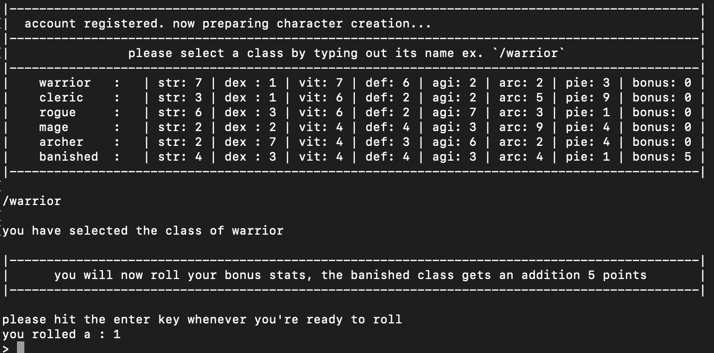

# Muddy-Waters

Muddy Waters is my take on a MuD using Node.js, and write.

To run the project navigate to the project folder in your terminal -> Run the command [npm run cli]

Muddy Waters will begin to run...

A list of commands can be found by using the /help command after the game has started.

Additional files for save data will be generated upon account creation, you may see a new directory appear called '/save'

